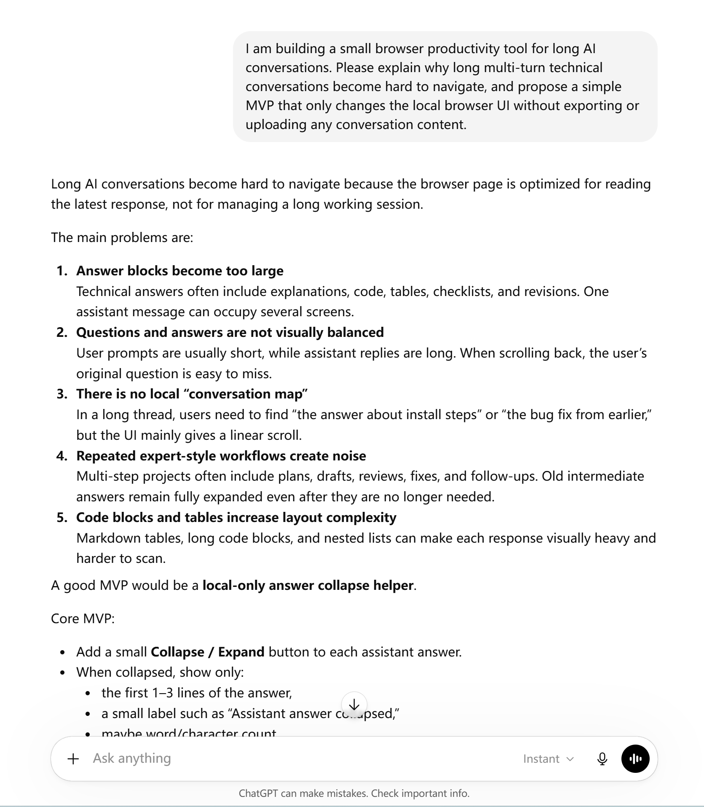
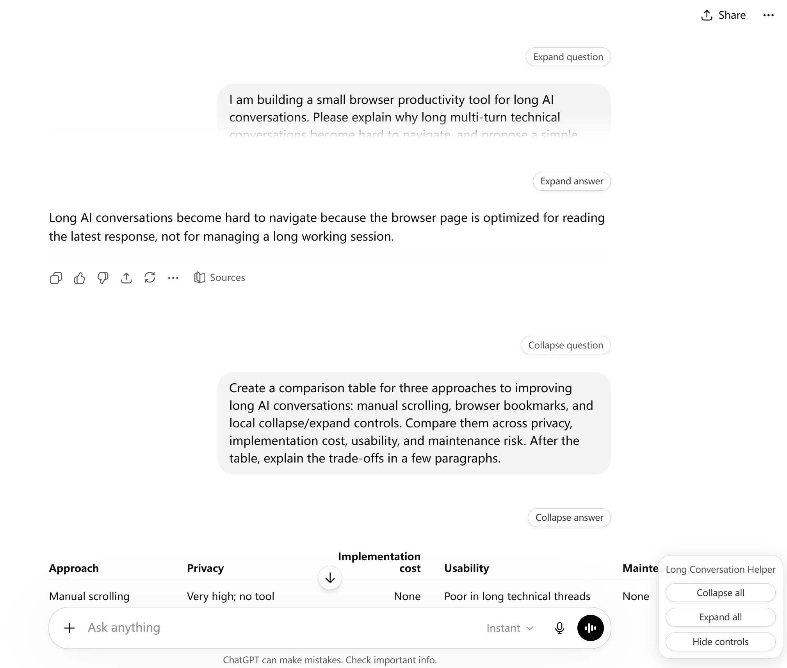
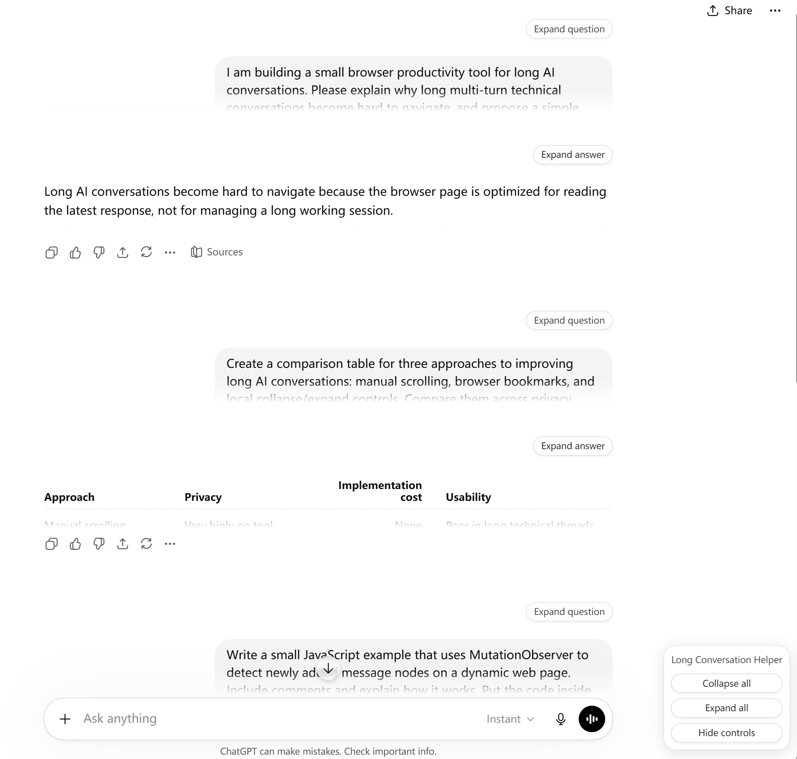
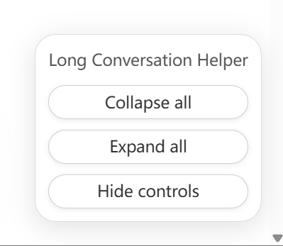

# ChatGPT Long Conversation Helper

A privacy-first Tampermonkey userscript that helps navigate long ChatGPT conversations by collapsing and expanding questions and answers locally in the browser.

> This is a third-party local userscript. It is not an official OpenAI or ChatGPT feature.

## Why this project

Long ChatGPT conversations are useful for complex technical workflows, but they become difficult to review after many rounds.

This is especially common in workflows such as:

- technical writing planning;
- code review and debugging discussions;
- API and tooling design notes;
- documentation drafting;
- AI-assisted engineering workflows;
- long-form project planning.

The first version of this project focuses on one practical problem: reducing visual noise in long conversations without exporting, uploading, or externally processing conversation content.

The first implementation started from long assistant replies, then added question collapsing because long prompts can also make technical conversations difficult to scan.

## MVP scope

Version `v0.1.1` focuses on local collapse and expand behavior.

It supports:

- collapsing user questions;
- collapsing assistant answers;
- showing a three-line preview;
- adding a fade mask near the third preview line;
- collapsing all visible conversation messages;
- expanding all visible conversation messages;
- hiding the full control panel into a compact `LCH` launcher;
- remembering local collapsed / expanded state with `localStorage`.

Future versions may add lightweight labels for marking important or secondary messages, but the MVP intentionally avoids extra UI complexity.

## Features

- Adds a local collapse / expand button to ChatGPT user questions and assistant answers.
- Keeps a three-line preview when a message is collapsed.
- Adds a subtle fade effect near the third preview line.
- Provides bottom-right global controls:
  - Collapse all
  - Expand all
  - Hide controls
- Converts the hidden global panel into a compact `LCH` launcher button.
- Uses `MutationObserver` to detect dynamically added messages.
- Uses CSS injection for local visual changes.
- Uses `localStorage` to remember local collapsed / expanded state and local panel visibility.
- Runs only on `https://chatgpt.com/*`.
- Requires no backend server, build tool, npm package, or external dependency.

## What it does not do

This project is intentionally limited.

- It does not send, upload, collect, or transmit conversation content.
- It does not call the ChatGPT API.
- It does not automate sending messages.
- It does not scrape or export conversations.
- It does not bypass ChatGPT limits or protections.
- It does not read cookies, tokens, account data, payment data, or settings.
- It only modifies the local browser view.
- It stores only local UI state in `localStorage`.

## Installation

### 1. Install Tampermonkey

Install Tampermonkey from your browser's official extension store.

After installation, pin the Tampermonkey icon to the browser toolbar if it is hidden behind the browser extension menu.

### 2. Enable userscript execution in Chrome if required

Some Chrome / Chromium-based browser versions require userscript execution to be explicitly allowed before Tampermonkey scripts can run.

Open:

```text
chrome://extensions/
```

Then:

1. Find `Tampermonkey`.
2. Open `Details`.
3. Enable `Allow User Scripts` if the option is shown.
4. If Chrome asks for Developer Mode before allowing userscripts, enable Developer Mode and then enable userscript execution.
5. Refresh `https://chatgpt.com/` after changing the setting.

If this step is missed, the script may be enabled in Tampermonkey but still not appear on the ChatGPT page.

### 3. Create a new userscript

Open the Tampermonkey dashboard and create a new script.

Usually:

```text
Tampermonkey icon → Dashboard → Create a new script
```

### 4. Paste the script

Copy the complete content of:

```text
chatgpt-long-conversation-helper.user.js
```

Delete the default Tampermonkey template and paste the script into the editor.

### 5. Save and enable the script

Save the userscript with:

```text
Ctrl + S
```

Then confirm the script is enabled in Tampermonkey.

### 6. Open ChatGPT

Open a long ChatGPT conversation at:

```text
https://chatgpt.com/
```

The script should add local collapse / expand controls to visible questions and answers.

## Usage

### Collapse one question or answer

Click the button above a message:

```text
Collapse question
```

or:

```text
Collapse answer
```

The message will shrink to a three-line preview.

### Expand one question or answer

Click:

```text
Expand question
```

or:

```text
Expand answer
```

The full message will become visible again.

### Collapse all messages

Use the floating control panel in the bottom-right corner and click:

```text
Collapse all
```

### Expand all messages

Click:

```text
Expand all
```

### Hide and reopen global controls

Click:

```text
Hide controls
```

The full panel will collapse into a compact `LCH` launcher near the lower-right area.

Click:

```text
LCH
```

to reopen the full control panel.

## Screenshots

### Before: long conversation without collapsed messages



### Single message control



### After: multiple messages collapsed



### Global controls



### Compact LCH launcher


## Privacy

This script is designed as a local browser UI enhancement.

It does not send conversation content anywhere.

The only persisted data is local UI state stored in `localStorage`, scoped by the current URL path, message role, and message index.

Example state:

```text
clch:v0.1.1:/c/example-conversation:assistant:4:collapsed = 1
```

The script does not store message text.

For more details, see:

```text
docs/privacy.md
```

## Technical design

The script uses a simple browser-side architecture:

1. Tampermonkey metadata limits the script to `https://chatgpt.com/*`.
2. A selector strategy finds visible user and assistant message containers.
3. Each message receives a local collapse / expand toolbar.
4. The script does not re-parent or re-wrap ChatGPT message content.
5. CSS controls preview height, overflow, and fade effect.
6. A floating global control panel can collapse or expand all processed messages.
7. The full panel can be hidden into a compact `LCH` launcher.
8. A `MutationObserver` detects newly inserted messages.
9. `localStorage` stores only collapsed / expanded state and local panel visibility.

## Selector strategy

The script prefers shallow role-based selectors such as:

```javascript
[data-message-author-role="user"]
[data-message-author-role="assistant"]
```

It avoids deep class-name chains because ChatGPT's frontend DOM can change.

The selector configuration is grouped near the top of the userscript so it can be adjusted later if the ChatGPT page structure changes.

## Code-level privacy review

The userscript is intentionally small and local. In the current codebase, there is no use of:

```text
fetch
XMLHttpRequest
navigator.sendBeacon
WebSocket
eval
document.cookie
@require
remote script URLs
analytics SDKs
telemetry endpoints
```

The main browser APIs used are:

```text
querySelectorAll
MutationObserver
localStorage
classList
addEventListener
```

This keeps the project aligned with its privacy-first scope: local UI changes only.

## Limitations

This is a best-effort UI enhancement.

Known limitations:

- ChatGPT DOM changes may break selectors.
- Streaming replies may not always be processed immediately.
- Collapse state is index-based and may shift if the conversation structure changes.
- Refresh-state recovery is useful but not guaranteed to be perfect.
- The script is tested manually, not against an official ChatGPT extension API.

For more details, see:

```text
docs/limitations.md
```

## Troubleshooting

If buttons do not appear:

1. Confirm the script is enabled in Tampermonkey.
2. Confirm the page URL starts with `https://chatgpt.com/`.
3. In Chrome, confirm `Allow User Scripts` is enabled for Tampermonkey if the option is shown.
4. Save the script and refresh the ChatGPT page.
5. Open a long conversation with several user questions and assistant answers.
6. Check the browser console for `[CLCH]` warnings.

For more details, see:

```text
docs/troubleshooting.md
```

## Roadmap

### v0.1.1

- Collapse and expand questions.
- Collapse and expand answers.
- Three-line preview with fade effect.
- Global collapse / expand controls.
- Compact `LCH` launcher after hiding controls.
- `MutationObserver` support.
- Local collapsed / expanded state with `localStorage`.
- Privacy-first documentation.
- Reduced layout risk by avoiding message DOM re-parenting.

### Possible v0.2.0

- Lightweight message labels.
- Color labels for important / secondary messages.
- Configurable preview line count.
- Improved selector fallback.
- Optional keyboard shortcuts.
- Better dark-mode visual tuning.

### Not planned for the MVP

- Chrome Extension.
- Edge Extension.
- Cloud sync.
- API integration.
- Conversation export.
- AI summarization.
- User accounts.
- Backend server.

## Manual testing and FAQ

For detailed local testing steps, see:

```text
docs/manual-test-plan.md
```

For installation and usage questions, see:

```text
docs/faq.md
```

For public screenshot prompts, see:

```text
docs/screenshot-test-prompts.md
```

## Related writing

- [Build a Privacy-First Tampermonkey Script for Long ChatGPT Conversations](https://dev.to/bob_oner/build-a-privacy-first-tampermonkey-script-for-long-chatgpt-conversations-2765)
- [AI-Assisted Development Is Not Autopilot](https://dev.to/bob_oner/ai-assisted-development-is-not-autopilot-15ie)

## License

MIT License.

See:

```text
LICENSE
```
